# AgroNext

AgroNext is a livestock health management platform designed to improve the efficiency and effectiveness of livestock care and monitoring. It leverages IoT, machine learning, and data analysis to assist farmers in tracking health metrics, insemination schedules, and daily tasks.

---

## Table of Contents
- [Overview](#overview)
- [Features](#features)
- [System Architecture](#system-architecture)
- [App Design](#app-design)
- [Contributing](#contributing)
- [License](#license)

---

## Overview

AgroNext focuses on digitalizing livestock management and addressing key challenges in:
- **Health Monitoring**: Tracks and analyzes livestock health metrics.
- **Insemination Scheduling**: Ensures timely and accurate insemination.
- **Task Automation**: Manages daily livestock-related tasks.

By utilizing modern technologies like IoT sensors, RabbitMQ, and machine learning models, AgroNext enables farmers to make data-driven decisions for enhanced productivity and animal welfare.

---

## Features

### 1. Health Monitoring
- Tracks physical and behavioral health metrics.
- Provides visual health monitoring charts.

### 2. Livestock Management
- Manage animals, groups, and tasks through a streamlined interface.
- Record-keeping for breeding history and health events.

### 3. Insemination Scheduling
- Predicts the optimal time for insemination using machine learning.
- Monitors estrous cycles with real-time updates.

### 4. Task Management
- Add, view, and manage daily tasks and schedules.

---

## System Architecture

The following diagram outlines the system architecture of AgroNext:

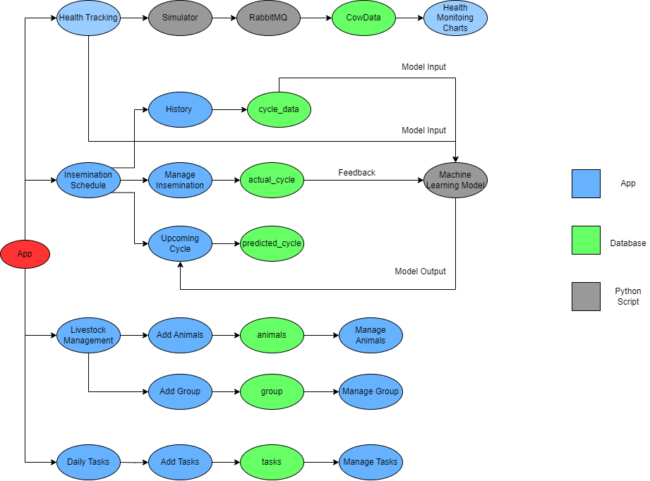

### Key Components
- **Health Tracking**: Tracks livestock health and provides visual insights.
- **Simulator**: Simulates cycle predictions using historical and real-time data.
- **RabbitMQ**: Manages asynchronous message queues for data communication.
- **Machine Learning Model**: Predicts estrous cycles for accurate insemination scheduling.
- **CowData**: Stores and processes livestock data for health and cycle tracking.

---

## App Design

The user interface and experience for AgroNext are designed using Figma. Below are the key screens:

### Login Flow

#### Splash Screen


#### Language Selection
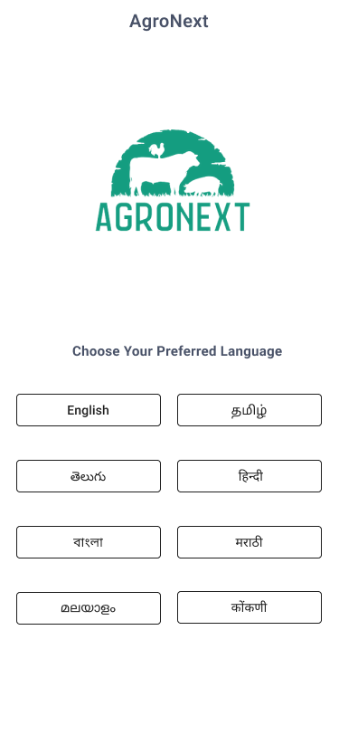

#### Login Screen
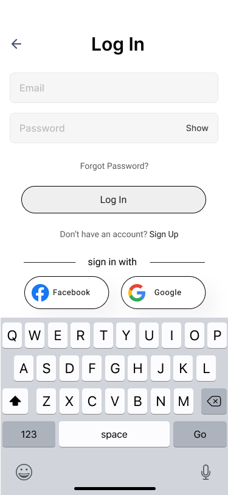

#### Register with Email
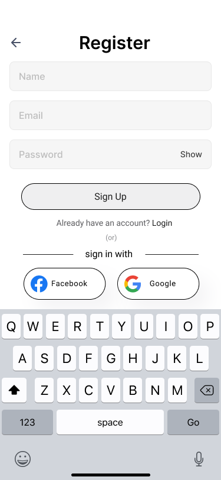

#### Intro Screen
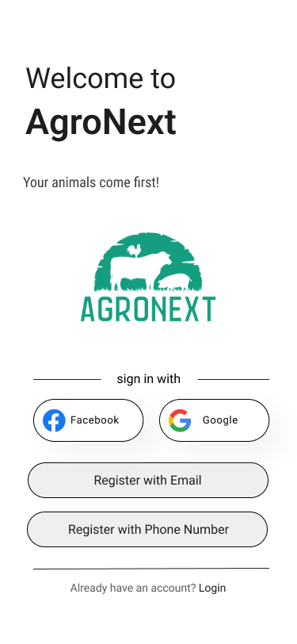

### Dashboard

#### Home Screen
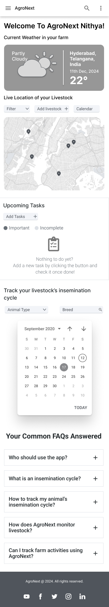

### Health Monitoring

#### Cow Health Monitoring
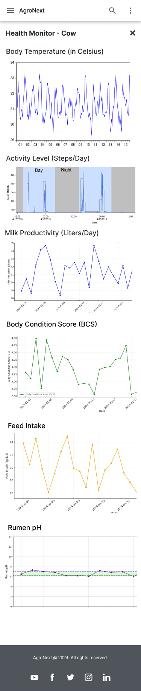

#### Bull Health Monitoring
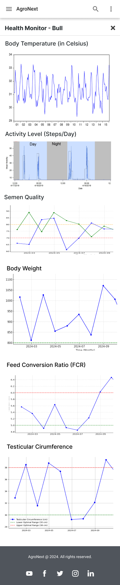

### Task Management

#### Daily Tasks
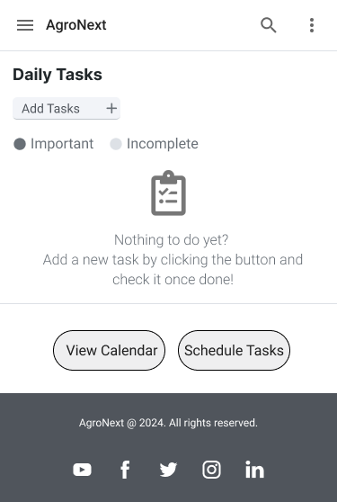

#### Add Tasks
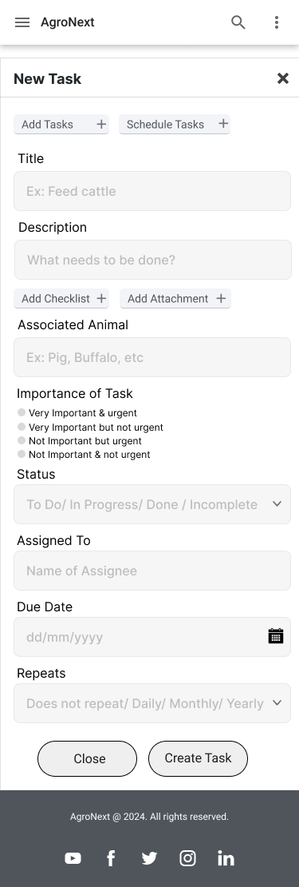

#### Schedule Tasks
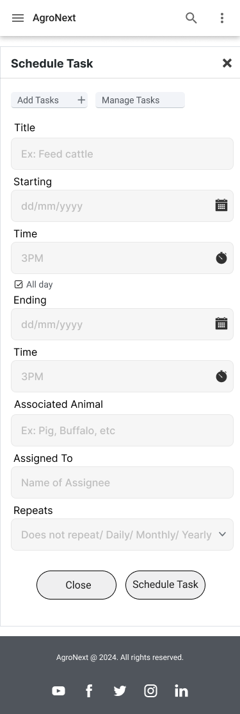

#### Manage Tasks
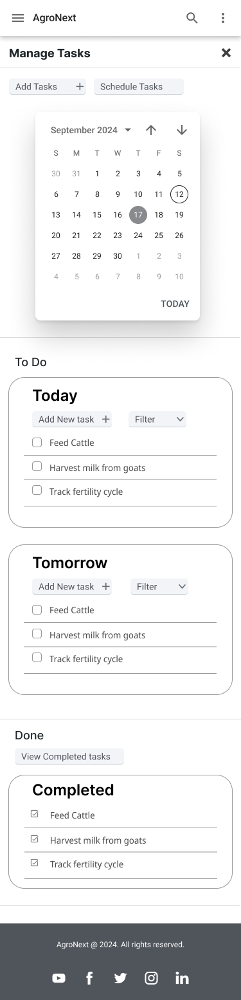

### Inseminaton Cycle Tracking

#### Update Cycle


#### History
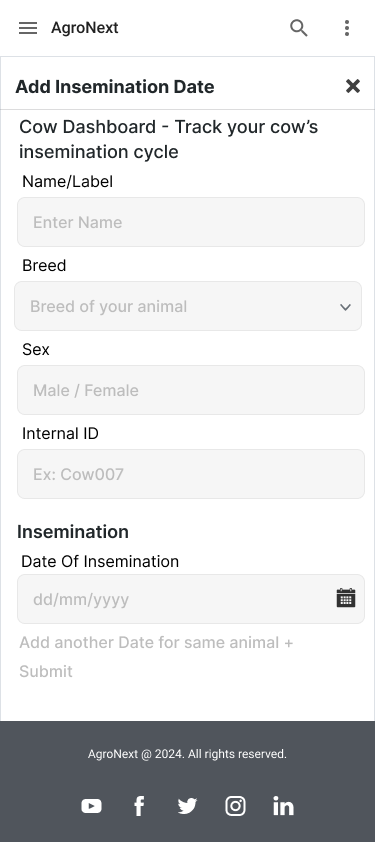

#### Upcoming Cycle Alert
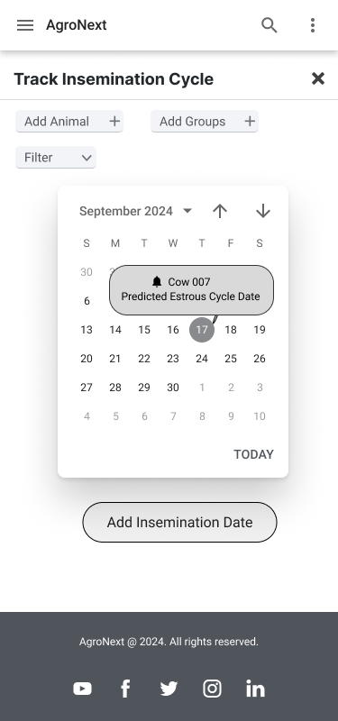

### Group Management

#### Add Animal
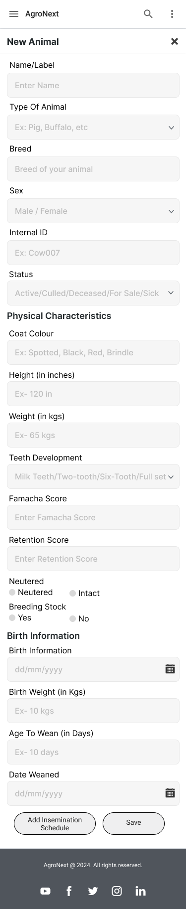

---

## Contributing

We welcome contributions to AgroNext! Here's how you can contribute:

1. Fork the repository.
2. Create a new branch:
   ```bash
   git checkout -b feature-branch
   ```
3. Make your changes and commit:
   ```bash
   git commit -m "Description of changes"
   ```
4. Push to your branch:
   ```bash
   git push origin feature-branch
   ```
5. Open a pull request.

---

## License

This project is licensed under the MIT License. See the [LICENSE](LICENSE) file for details.
